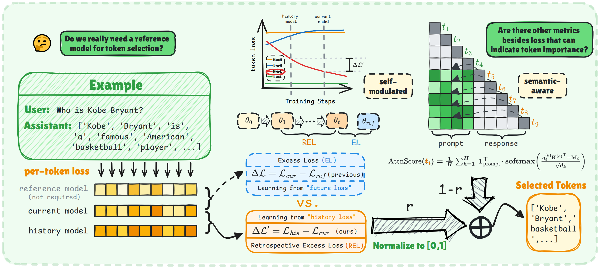

# [ICLR 2026] ssToken: Self-modulated and Semantic-aware Token Selection for LLM Fine-tuning

<a href='https://arxiv.org/abs/2510.18250'></a>

This repository contains the official implementation of **ssToken**, accepted at **ICLR 2026**.

## Overview

Supervised fine-tuning (SFT) quality is highly sensitive to token-level noise. Existing token selection methods typically rely on an extra reference model and loss-only criteria, which can miss semantically important tokens.

**ssToken** addresses these limitations with two complementary signals:

- **Self-modulated selection (REL):** uses retrospective excess loss between the current model and its history model, avoiding a separately trained reference model.
- **Semantic-aware selection (attention score):** estimates token importance from attention patterns, complementing loss-based filtering.

The final token score is computed as:

`Score(x_i) = gamma * Normalize(REL(x_i)) + (1 - gamma) * AttnScore(x_i)`

where `gamma` controls the trade-off between optimization signal and semantic signal.




## Installation

We recommend Python 3.10+ and a CUDA-compatible PyTorch installation.

```bash
pip install -r requirements.txt
```

## Dataset Preparation

Consistent with [TokenCleaning](https://github.com/UCSC-REAL/TokenCleaning), we adopt the same data preparation setup.

The data pool (50k samples) is constructed based on a new powerful data curation pipeline [**DS2**](https://github.com/UCSC-REAL/DS2), which involves selecting data samples using quality rating scores generated by LLMs. For convenience, the 50k used samples can be accessed from Huggingface via the [link](https://huggingface.co/datasets/jlpang888/DS2_50k).

## Quick Start

### 1) Compute token-level base losses

Before ssToken training, compute token losses for the base/history model:

```bash
bash bash_src/calculate_loss.sh <model_name_or_path> <train_data_json> <per_device_batch_size> <num_gpus>
```


### 2) Configure the history loss path

In the current code release, `scripts/finetune.py` loads history losses from a placeholder path:

```python
ref_token_losses = torch.load("your_path_to_base_model_losses.pt")
```

Please set it to your generated loss file (e.g., under `results/loss/`).

### 3) Run ssToken fine-tuning

```bash
bash run.sh <ratio> <data_prop> <run_name>
```

- `ratio`: `gamma` in the paper (balance between REL and attention).
- `data_prop`: token selection ratio `rho`.
- `run_name`: output run identifier.


Merged model output is saved to:

`./model/<base_model_name>/lora_merged_<run_name>/`

## Evaluation

### lm-eval-harness tasks

```bash
bash eval.sh <model_path> <task_name_or_all>
```

### TyDiQA

```bash
bash prepare_eval_data.sh
bash eval_tydiqa.sh <model_path>
```

## Notes

- `eval.sh` sets `HF_DATASETS_OFFLINE=1` by default; adjust if online dataset access is needed.
- For large models, tune batch size and GPU count according to available memory.
- The codebase includes implementations for random/default/token-selection regimes via `token_select_pattern`.

## Citation
If you find this repository useful, please cite:

```bibtex
@article{qin2025sstoken,
  title={ssToken: Self-modulated and Semantic-aware Token Selection for LLM Fine-tuning},
  author={Qin, Xiaohan and Wang, Xiaoxing and Liao, Ning and Zhang, Cancheng and Zhang, Xiangdong and Feng, Mingquan and Wang, Jingzhi and Yan, Junchi},
  journal={arXiv preprint arXiv:2510.18250},
  year={2025}
}
```
